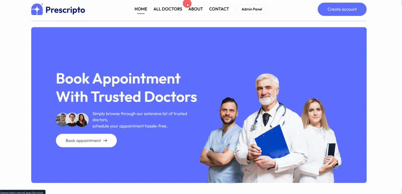

# MediPulse - Doctor Booking Appointment System

---

## 🚀 Overview

**MediPulse** is a full-stack Doctor Booking Appointment System built to simplify and automate the process of booking healthcare consultations. It provides a seamless experience for both doctors and patients, from appointment scheduling to management.

---

## ✨ Features

- **🔵 User Registration & Login**
  - Patients and doctors can securely create accounts and login.
  - Separate dashboards based on user roles.

- **🩺 Doctor Profile Management**
  - Doctors can update their specialization, experience, consultation fees, availability, and personal information.

- **📅 Appointment Booking System**
  - Patients can view available doctors and book appointments easily based on date and time slots.
  - Doctors can accept or reject appointment requests.

- **🔔 Real-Time Notifications**
  - Email or in-app notifications sent for appointment confirmations, cancellations, or reschedules.

- **📊 Admin Dashboard**
  - Admin can manage users (doctors & patients), monitor appointment status, and generate reports.

- **⚡ Fast Search & Filter**
  - Search doctors by specialty, location, fees, or availability.

- **🔒 Secure Authentication**
  - Password encryption and secure token-based session handling.

- **📱 Mobile Responsive Design**
  - Fully responsive — works on desktop, tablet, and mobile screens.

- **🌐 Built-in Support System**
  - Contact or raise a ticket for support directly from the app.

- **🛡️ Robust Backend API**
  - RESTful API with proper validations, error handling, and role-based access controls.

---

## 📂 Project Structure

